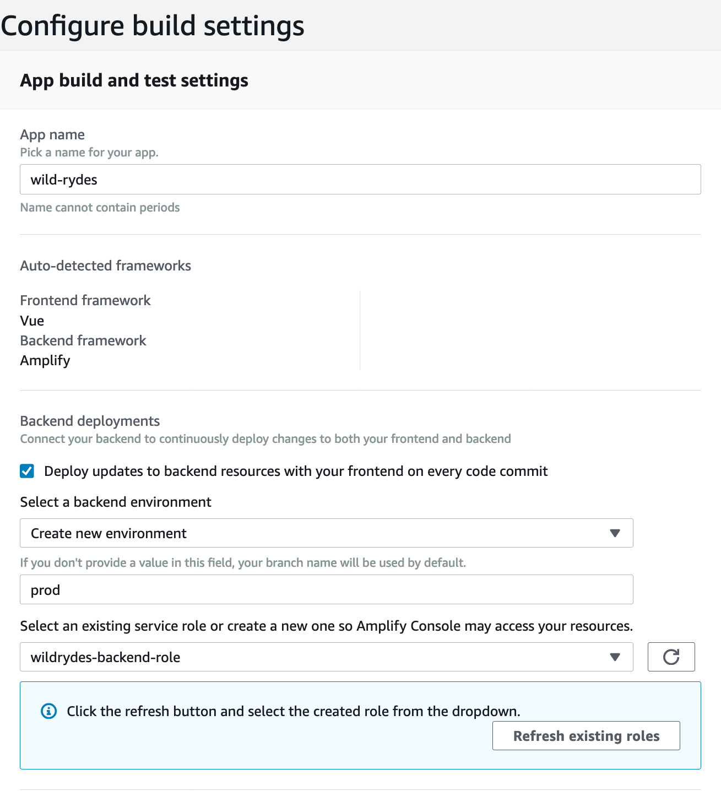
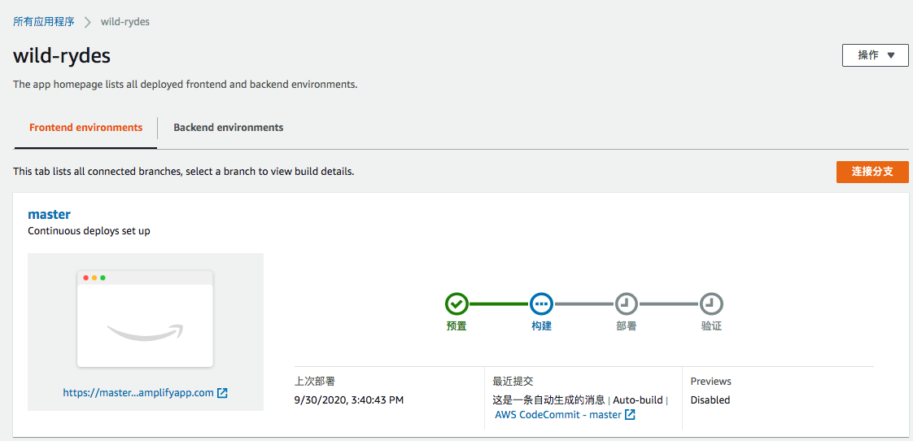

# 1.静态网站托管

## 1.1 概要

在本章节中你将会通过配置AWS Amplify Console服务从而实现应用静态网站的托管。在接下来的模块中，你将会通过Javascript调用基于AWS Lambda和API Gateway服务的 RESTFul API来实现动态模块的添加。

### 架构概览

该模块的体系结构非常简单。您的所有静态Web内容（包括HTML，CSS，JavaScript，图像和其他文件）将由AWS Amplify Console管理，并通过Amazon CloudFront提供。然后，您的最终用户将使用AWS Amplify Console所生成的URL访问您的网站。您无需运行任何Web服务器或使用其他服务即可创建该网站


### 实现指导

> 请确保完成配置步骤

以下各节提供了实施概述和详细的分步说明。如果您已经熟悉AWS管理控制台，或者想要自己探索服务而又不跟随演练，那么概述应该已经为您提供足够的背景信息来完成。


## 1.2 Region选择

### Region 选择

可以在支持以下服务的任何AWS区域中部署此研讨会步骤

* AWS Amplify Console
* AWS CodeCommit

您可以参考AWS文档中的AWS[区域列表](https://aws.amazon.com/about-aws/global-infrastructure/regional-product-services/)，以查看哪些区域具有受支持的服务。您可以选择的受支持地区包括：

* 北美: N. Virginia, Ohio, Oregon
* 欧洲：Ireland, London, Frankfurt
* 亚洲：Tokyo, Seoul, Singapore, Sydney, Mumbai

选择地区后，您**应该在此区域**部署该研讨会的所有资源。在开始之前，请确保您从AWS控制台右上角的下拉列表中选择您的区域。


## 1.3 代码仓库

### 创建代码仓库

本实验将会使用AWS CodeCommit来托管你的代码. CodeCommit包含在AWS的[免费使用额度里](https://aws.amazon.com/free/?all-free-tier.sort-by=item.additionalFields.SortRank&all-free-tier.sort-order=asc&all-free-tier.q=CodeCommit&all-free-tier.q_operator=AND)

#### 使用Codecommit

AWS Cloud9开发环境随附与您的IAM用户关联的AWS托管临时凭证。您可以将这些凭证与AWS git-remote-codecommit工具（Git远程帮助器，可以更轻松地与AWS CodeCommit进行交互）一起使用。默认情况下，此工具安装在Cloud9中。您可以通过在终端中运行以下命令，将其安装在自己的计算机上：

```sudo pip install git-remote-codecommit
sudo pip install git-remote-codecommit
```

接下来，您需要创建存储库并将其克隆到您的Cloud9环境中

```
aws codecommit create-repository --repository-name wild-rydes
```

使用git clone --bare克隆模板存储库

```
git clone --bare https://github.com/bls20AWS/wildRydesVue.git
```

push --mirror 到的你的新仓库中

```
cd wildRydesVue.git
git push --mirror codecommit://wild-rydes
```

删除临时本地存储库

```
cd ..
rm -rf wildRydesVue.git
```

将新的存储库克隆到您的开发环境

```
git clone codecommit://wild-rydes
```

确保工作在Master分支

```
aws codecommit update-default-branch \
--repository-name wild-rydes \
--default-branch-name master

cd wild-rydes
git checkout master
```


## 1.4 部署

### 通过Amplify Console进行部署

接下来，您将使用AWS Amplify控制台部署刚刚提交给git的网站。 Amplify控制台负责设置存储静态Web应用程序代码的位置，并提供了许多实用的功能，从而简化该应用程序的生命周期管理。

**✅ 分步指导**

1. 打开[Amplify Console](https://console.aws.amazon.com/amplify/home)

2. 在**部署**下拉菜单下，选择**入门**

   > 根据您的控制台和帐户设置，您可能看不到部署提示。在这种情况下，请选择**创建应用程序**

3. 选择AWS CodeCommit，然后选择继续
4. 从下拉列表中选择上一步创建的存储库和主分支，然后选择下一步
5. Amplify将检测到应用程序具有现有的Amplify后端。选择**创建新环境**（Create New Environment）并将其命名为prod（全部小写)

 现在，您需要创建一个具有部署应用程序后端权限的新服务角色

1. 单击创建新角色（Create new role），检查是否选中了放大，然后单击下一步: 权限，再单击下一步：标签，再单击下一步：审阅

2. 为角色指定一个新名称：**wildrydes-backend-role**，然后单击“创建角色”。关闭此选项卡，然后返回到AWS Amplify Build配置控制台

3. 通过单击圆形箭头按钮刷新角色列表，然后选择在上述步骤中创建的角色

   

4. 选择下一步

5. 在**查看**页面上，选择**保存并部署**

   初始构建和部署过程最多可能需要五分钟，Amplify Console才能创建必要的资源并部署您的代码

   

   完成后，单击站点图像以启动Wild Rydes站点

   


## 1.5 改进

### 修改网站配置

当检测到对已连接代码存储库的更改时，AWS Amplify Console将重建并重新部署该应用程序。更改主页以测试此过程

**✅ 分步指导**

1. 在您的Cloud9环境中，打开存储库**/wild-rydes/public/**目录中的**index.html**文件

2. 修改Title 行

   ```
    <title>wildrydes</title>
   ```

   变更为：

   ```
    <title>Wild Rydes - Rydes of the Future!</title>
   ```

   保存修改

3. 再次将更改提交到git存储库：

   ```
   git add . 
   
   git commit -m "updated title"
       
   git push
   ```

   Amplify Console在注意到存储库更新后不久将再次开始构建站点。这很快发生！您可以回到Amplify Console观看构建过程

4. 完成后，重新打开Wild Rydes网站并注意标题更改

   

 ## 1.6 回顾

🔑AWS Amplify Console可通过持续集成和持续交付轻松部署静态网站。它能够构建更复杂的基于JavaScript框架的应用程序，并向您显示应用程序在流行的移动平台上呈现时的预览。 

🔧在此模块中，您创建了一个静态网站，它将作为我们Wild Rydes业务的基础。


#### 下一步

✅继续执行下一个模块，即用[用户模块](2.用户管理.md)，您将在其中使用AWS Amplify CLI配置Amazon Cognito用户池，以管理我们应用程序的用户


