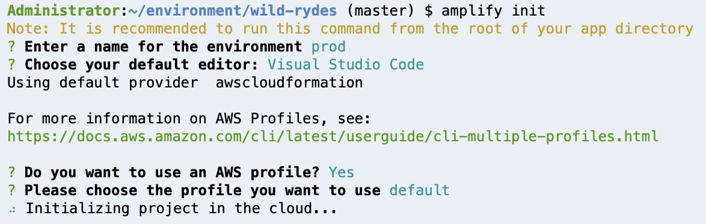
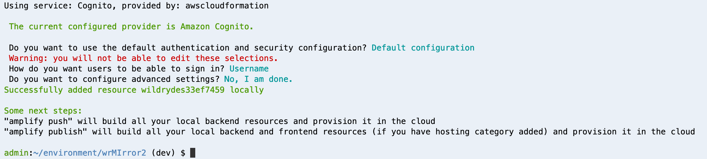
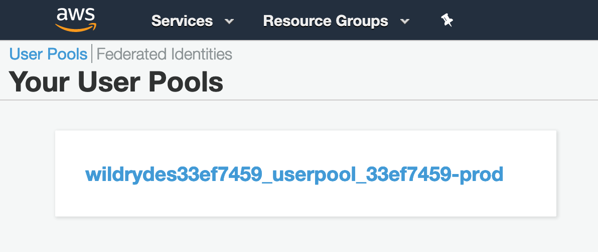
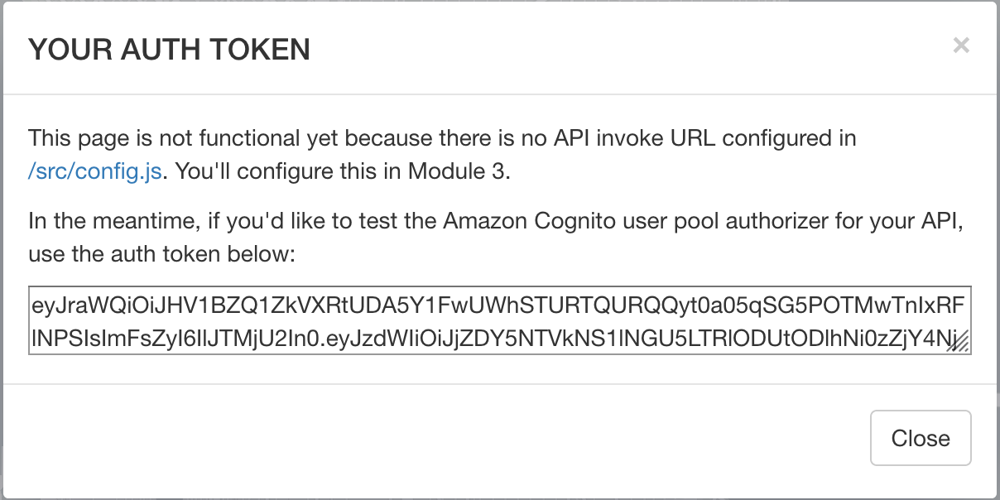

# 2.用户管理

## 2.1 概要

在本模块中，您将使用AWS Amplify CLI创建一个Amazon Cognito用户池来管理您的用户账户。您将部署登录界面，使客户能够注册为新用户，验证其电子邮件地址并登录该网站。

### 架构介绍

用户访问您的网站时，他们将首先注册一个新的用户帐户。就本研讨会而言，我们仅要求他们提供电子邮件地址和密码进行注册。除此之外，您可以配置Amazon Cognito以在应用程序中要求其他属性。

用户提交注册后，Amazon Cognito将向他们提供的地址发送一封确认电子邮件，其中包含**验证码**。为了确认其帐户，用户将返回您的网站并输入其电子邮件地址和收到的验证码。如果您想使用假电子邮件地址进行测试，也可以直接使用Amazon Cognito控制台确认用户帐户。

用户拥有确认的帐户后（使用电子邮件验证过程或通过控制台进行手动确认），便可以进行登录。用户登录后，可以输入用户名（或电子邮件）和密码。然后，JavaScript函数将会与Amazon Cognito通信，使用安全远程密码协议（SRP）进行身份验证，并接收回一组JSON Web TOKEN（JWT）。 JWT包含有关用户身份的声明，并将在下一个模块中用于根据您使用Amazon API Gateway构建的RESTful API进行身份验证。


### 实现指导

> ❗️ 请确保已经完成了静态网站托管模块

以下各节提供了实施概述和详细的分步说明。如果您已经熟悉AWS管理控制台，或者想要自己浏览服务而又不遵循演练，那么概述已经为您提供足够的上下文来完成实施。


## 2.2 Amplify Cli

### 初始化Amplify

#### 背景介绍

AWS Amplify命令行界面（CLI）是一个统一的工具链，覆盖应用程序创建，集成和管理所需要的AWS云服务。 Amplify CLI工具链旨在与Amplify JavaScript库以及适用于iOS和Android的AWS Mobile SDK一起使用.

AWS Amplify Authentication模块为想要创建用户身份验证体验的开发人员提供了Authentication API和基础包

**✅ 分步介绍 **

1. 通过Cloud9终端窗口中运行以下命令来安装Amplify Cli

   ```
   npm install -g @aws-amplify/cli
   ```

   > 更多信息可以[参考](https://github.com/aws-amplify/amplify-cli#install-the-cli)

   配置默认AWS profile

   ```
   echo '[profile default]' > ~/.aws/config
   ```

2. 进入wild-rydes的根目录

   初始化Amplify cli

   ```
   amplify init
   ```

   整个项目初始化将会花费一小段时间

   > 确保提供与先前提供的相同的环境名称,如prod

   

   通过输入以下命令来验证初始化是否完成。4.29.3或更高版本应该被安装

   ```
   amplify version
   ```

   接下来，您将通过AWS Amplify Cli将Amazon Cognito Category添加到您的AWS Amplify配置中

## 2.3 用户池（User Pool）

### 背景

AWS Amplify Authentication模块为想要创建用户身份验证体验的开发人员提供了Authentication API和构建块。

Amazon Cognito用户池（User Pool）是一项功能齐全的用户目录服务，用于处理用户注册，身份验证和帐户恢复。另一方面，Amazon Cognito联合身份是授权用户使用AWS服务的一种方式。

Amplify与用户池的的接口以存储您的用户信息。这包括与其他OpenID提供程序（如Facebook和Google）的联合认证。 Amplify还使用联合身份来管理用户对AWS资源的访问，例如允许用户将文件上传到S3存储桶。 Amplify CLI自动执行这些AWS资源的访问控制策略，并通过GraphQL提供细粒度的访问控制，以保护API中的数据。

在本节中，您将使用Amplify CLI使用默认设置创建一个新的Cognito用户池。然后，您使用Amazon Cognito控制台来管理新的用户池。

### Amazon Cognito

**✅ 分步指导**

1. 执行以下命令以添加用户池

   ```
   amplify add auth
   ```

   现在，AWS Amplify Cli将通过Amazon Cognito的设置运行，选择以下内容：

   ```
   > Do you want to use the default authentication and security configuration? "Default configuration"
   > How do you want users to be able to sign in? "Username"
   > Do you want to configure advanced settings? "No, I am done."
   ```

   一旦配置完成后，你将会看到以下的确认信息：

   

   > ❗️不要运行amplify push 或 amplify publish 
   > 这将创建重复的后端资源。当您将代码推送到存储库时，Amplify Console便会自动创建必要的资源

2. 提交代码更新以在云中置备Amplify后端资源，并开始新的构建

   ```
   git add .
   
   git commit -m "Configure Cognito"
   
   git push
   ```

   Amplify Console接受更改，然后就会自动开始构建和部署Web应用程序

## 2.4 APP 客户端（Client）配置

AWS Amplify构建已创建了一个新的App客户端。让我们来看看这个应用程序客户端

**✅ 分步指导**

1. [进入](https://console.aws.amazon.com/cognito/users?home)

2. 选择管理你的用户池（user pool）

   在这里，您将看到由AWS Amplify CLI生成的新用户池，其外观类似于以下示例：

   

3. 选择该用户池，并打开用户池的详细信息页面
4. 在池详细信页面上，从左侧导航栏中的**常规设置**部分选择**应用程序客户端**
5. 您将看到已生成一个新的App客户端。您的Web应用程序已配置为通过`wildrydes/src/aws-exports.js`中的配置文件使用此App客户端

### 原理

Amplify并非通过构造函数或常量文件配置每个服务，而是通过称为aws-exports.js的集中式文件来支持配置，该文件定义了要通信的所有区域和服务端点。每当您运行git commit来运行Amplify推送或重建Web应用程序时，都会自动创建此文件，使您可以专注于应用程序代码。 Amplify CLI将此文件放置在使用amplify init配置的适当源目录中

> ❗️ 您不会在本地文件存储中看到此文件的更新，因为它包含在* .gitignore *文件中.


## 2.5 创建用户

**注意：**我们无需使用前端代码来管理注册，验证和登录流程，通过使用AWS Amplify Authentication UI组件为您在第一个模块中部署的资产提供有效的实现.

Authenticator组件为应用程序提供基本的登录/注销功能，以及新用户注册和用户登录的确认步骤。

如 `<amplify-authenticator></amplify-authenticator>`

### 验证

**✅步骤**

1. 在您的网站域下访问/auth，或选择网站首页上的按钮**Giddy Up**！

2. 点击登录框底部的**创建帐户(create account)**链接

3. 填写注册表，然后选择**创建帐户**(create account)。您可以使用自己的电子邮件或输入伪造的电子邮件。确保选择一个至少包含一个大写字母，一个数字和一个特殊字符的密码。**不要忘记输入的密码**。您应该看到一条提示，确认您已创建用户。

   > ⚠️ 如果收到身份验证(Authentication Error)错误，则可能是因为您的更改尚未完成部署。

4. 使用以下两种方法之一确认您的新用户

   如果您使用自己控制的电子邮件地址，则可以通过输入电子邮件发送给您的验证码来完成帐户验证过程。请注意，验证电子邮件可能会最终出现在您的垃圾邮件文件夹中。对于生产环境部署，我们建议将您的用户池配置为使用Amazon Simple Email Service, 从而由您拥有的域发送电子邮件。

   如果您使用随意填写的电子邮件地址，则必须通过Cognito控制台手动确认用户。

   4.1 在AWS控制台中，单击服务，然后在安全性，身份和合规性下选择Cognito。

   4.2 选择管理您的用户池

   4.3 选择WildRydes用户池，然后单击左侧导航栏中的**用户和组**

   4.4 您应该看到与您通过注册页面提交的电子邮件地址相对应的用户。选择该用户名以查看用户详细信息页面

   4.5 选择**确认用户**以完成帐户创建过程

5. 使用验证码或Cognito控制台确认新用户后，单**返回登录**链接或刷新 /auth页面，并使用在注册步骤中输入的电子邮件地址和密码登录

6. 如果成功，则应将您重定向到/ride。您应该看到如下的界面：

   


## 2.6 回顾

🔑Amazon Cognito提供了两种不同的功能来管理用户，联合身份和用户池。 Amazon Cognito用户池几乎可以处理有关管理用户的所有方面，包括登录凭证，密码重置，多因素身份验证等等。

🔧在该模块中，您使用用户池创建了一个完全托管的用户管理系统，该系统可让您对用户进行身份验证并管理其用户信息。您已更新网站以使用用户池，并使用AWS开发工具包在网站上提供登录表单。

#### 接下来

✅成功登录Web应用程序后，您可以进入下一个模块，[无服务器后端](3.Serverless后端.md)

#### 额外

尝试复制收到的auth_token并将其粘贴到在线[JWT解码器](https://jwt.io/)中，以了解此令牌对您的应用程序意味着什么

