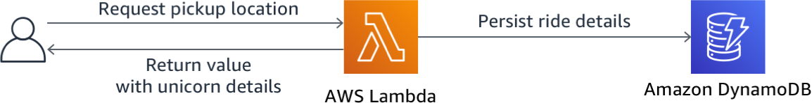
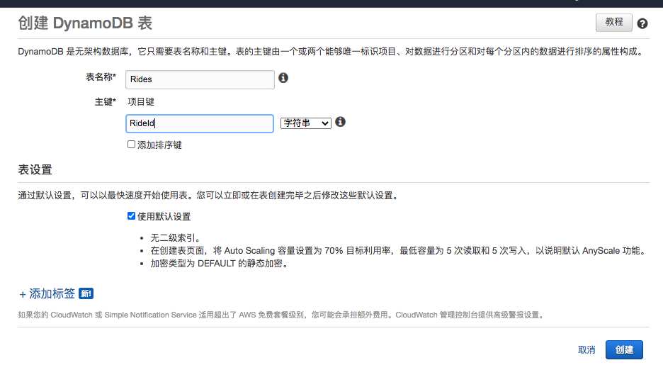
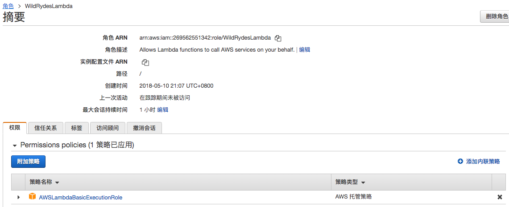
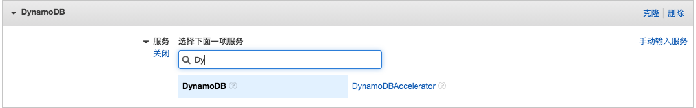
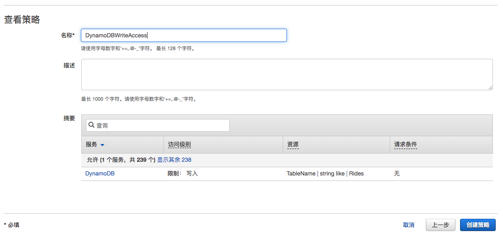
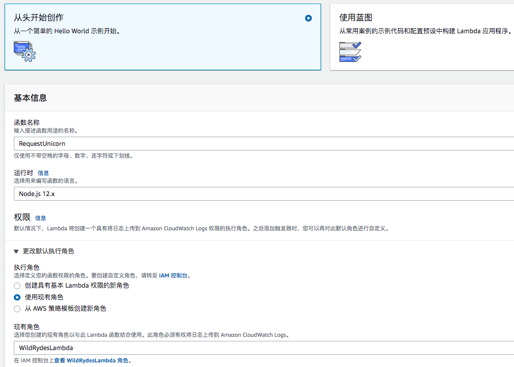
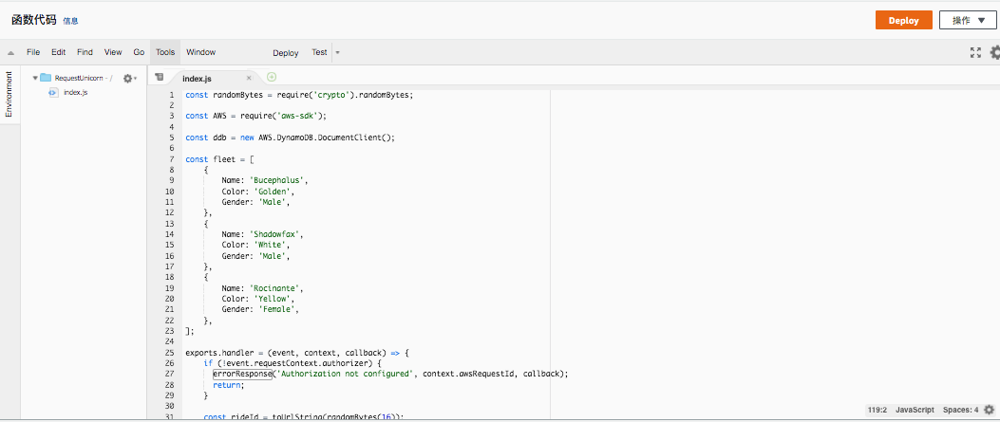
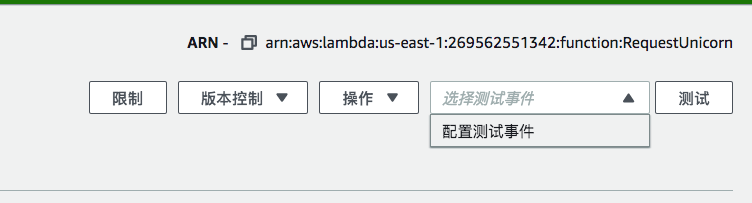
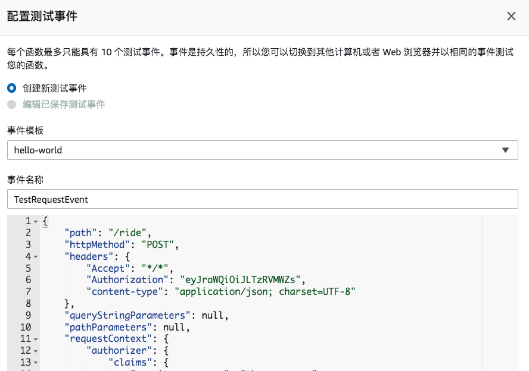

# 3. Serverless 后端

## 3.1 整体介绍

在此模块中，您将使用AWS Lambda和Amazon DynamoDB构建后端流程来处理来自Web应用程序的请求。您在第一个模块中部署的浏览器应用程序允许用户请求将独角兽发送到他们选择的位置。为了满足这些请求，浏览器中运行的JavaScript会调用云中运行的服务

您将实现Lambda函数，该函数将在用户每次请求独角兽时调用。该函数将会从队伍中选择一个独角兽，将请求记录在DynamoDB表中，并使用已调度的独角兽的详细信息响应前端应用程序



使用Amazon API Gateway从浏览器调用该功能。您将在下一个模块中实现该连接。对于此模块，您将单独测试功能。

###  实验指导

> ❗️ 请确保已经完成了用户管理模块

以下各节提供了实施概述和详细的分步说明。如果您已经熟悉AWS管理控制台，或者想要在不遵循演练的情况下自己探索服务，则概述应为您提供足够的背景信息以完成实施。

## 3.2 DYNAMODB 配置

使用Amazon DynamoDB控制台创建新的DynamoDB表。调用表Rides并为其分配一个名为RideId的分区键，其类型为String。表名和分区键区分大小写。确保使用提供的确切ID。其他选项保持默认。

创建完table后，请记录下对应的ARN

**✅ 分步指南**

1. 打开[Dynamodb界面](https://console.aws.amazon.com/dynamodb/home)

2. 选择创建表

3. 表名填入Rides，请注意大小写

4. 填写RideId为分区键，类型为String，请注意大小写 

5. 勾选使用默认配置按钮，并点击创建

   

6. 滚动到新表的**概述**部分的底部，并记录ARN。您将在下一部分中使用它

## 3.3 IAM 设置

### 背景

每个Lambda函数都有一个与之关联的IAM角色。该角色定义了允许该功能与之交互的其他AWS服务。在本研讨会中，您将创建一个IAM角色，该角色将授予Lambda函数权限以将日志写入Amazon CloudWatch Logs，并有权将写入DynamoDB表。

### 实验指导

使用IAM控制台创建新角色。将其命名为**WildRydesLambda**并选择AWS Lambda作为角色类型。您需要附加授予您的lambda函数的权，从而以写入Amazon CloudWatch Logs并将项目放入DynamoDB表。

将名为**AWSLambdaBasicExecutionRole**的托管策略附加到此角色，以授予必要的CloudWatch Logs权限。另外，为您的角色创建一个自定义内联策略，该策略允许对上一节中创建的表进行**dynamodb：PutItem**操作

**✅ 步骤**

1. 打开[IAM控制台](https://console.aws.amazon.com/iam/home)
2. 在左侧导航栏中选择**角色**，然后选择**创建角色**。

3. 从AWS服务组中选择Lambda作为角色类型，然后单击下一步：权限

   > 选择角色类型会自动为您的角色创建一个信任策略，该策略允许AWS服务代表您承担此角色。如果您使用CLI，AWS CloudFormation或其他机制创建此角色，则应直接指定信任策略

4. 在文本框中键入**AWSLambdaBasicExecutionRole**，然后选中该角色旁边的框
5. 选择**下一步：标签**，输入任意标签
6. 选择**下一步：审核**
7. 输入WildRydesLambda作为角色名称
8. 选择创建角色

接下来，您需要向该角色添加权限，以便该角色可以访问DynamoDB表。

**✅ 步骤**

1. 在角色页面上的IAM控制台中，在**角色**页面上的过滤器框中键入**WildRydesLambda**，然后选择刚创建的角色

2. 在**权限**选项卡上，选择右下角的**添加内联策略**链接以创建新的内联策略

   

3. 选择创建服务

4. 开始在标有**查找服务**的搜索框中输入DynamoDB，然后在出现时选择DynamoDB

   

5.选择**执行操作**

6.开始在标有**指定在 DynamoDB 中允许的操作**下方的搜索框中输入**PutItem**，并在显示时选中PutItem旁边的框

7.选择资源模块

8.选择**特定**选项后，在表（table）部分中选择**添加ARN**链接。

9.将在上一节中创建的表的ARN粘贴到**为表指定ARN**字段中，然后选择**添加**

10.选择查看政策。

11.输入**DynamoDBWriteAccess**作为策略名称，然后选择**创建策略**

​	

## 3.4 Lambda函数设置

### 背景

AWS Lambda运行您的代码以响应诸如HTTP请求之类的事件。在此步骤中，您将构建一个处理来自Web应用程序的API请求以调度独角兽的函数。在下一个模块中，您将使用Amazon API Gateway创建一个RESTful API，该API公开可以从您的用户浏览器调用的HTTP终端节点。然后，将在此步骤中创建的Lambda函数连接到该API，以为您的Web应用程序创建功能齐全的后端。

### 整体流程

使用AWS Lambda控制台创建一个名为**RequestUnicorn**的新Lambda函数，该函数可处理API请求。将此[示例](https://webapp.serverlessworkshops.io/serverlessbackend/lambda/requestUnicorn.js)复制并粘贴到lambda函数的编辑器中。 

配置您的lambda 函数以使用您在上一小节中创建的**WildRydesLambda IAM**角色 

**✅ 步骤**

1. 进入[Lambda控制台](https://console.aws.amazon.com/lambda/home)

2. 点击创建函数

3. 选择默认的**从头开始创作**

4. 名字处填写：RequestUnicorn

5. 运行时选择：Nodejs 12.x

6. 在权限下，展开更改默认执行角色

7. 确保从角色下拉列表中选择使用现有角色

8. 从**现有角色**下拉列表中选择**WildRydesLambda**

   

9. 选择创建函数

10. 向下滚动到**函数代码**部分，并用[**requestUnicorn.js**](https://webapp.serverlessworkshops.io/serverlessbackend/lambda/requestUnicorn.js)的内容替换**index.js**代码编辑器中的现有代码

    

    11. 点击右上角的**部署**(Deploy)按钮

### 配置确认

对于此模块，您将测试使用AWS Lambda控制台构建的功能。在下一个模块中，您将添加带有API Gateway的REST API，以便您可以从在第一个模块中部署的基于浏览器的应用程序中调用函数

**✅ 步骤**

1. 在功能的主编辑屏幕上，从**选择测试事件...**下拉列表中选择**配置测试事件**

   


2. 保持选中创建新的测试事件

3. 在事件名称字段中输入**TestRequestEvent**

4. 将以下测试事件复制并粘贴到编辑器中

   ```
   {
       "path": "/ride",
       "httpMethod": "POST",
       "headers": {
           "Accept": "*/*",
           "Authorization": "eyJraWQiOiJLTzRVMWZs",
           "content-type": "application/json; charset=UTF-8"
       },
       "queryStringParameters": null,
       "pathParameters": null,
       "requestContext": {
           "authorizer": {
               "claims": {
                   "cognito:username": "the_username"
               }
           }
       },
       "body": "{\"PickupLocation\":{\"Latitude\":47.6174755835663,\"Longitude\":-122.28837066650185}}"
   }
   ```

   

   5. 选择创建。 

   6. 在主功能编辑屏幕上，单击下拉列表中选择的**TestRequestEvent**, 然后点击测试。

   7. 滚动到页面顶部，然后展开**执行结果**部分的**详细信息**部分。

   8.  确认执行成功，并且函数结果如下所示

      ```
      {
        "statusCode": 201,
        "body": "{\"RideId\":\"1h0zDZ-6KLZaEQCPyqTxeQ\",\"Unicorn\":{\"Name\":\"Shadowfax\",\"Color\":\"White\",\"Gender\":\"Male\"},\"UnicornName\":\"Shadowfax\",\"Eta\":\"30 seconds\",\"Rider\":\"the_username\"}",
        "headers": {
          "Access-Control-Allow-Origin": "*"
        }
      }
      ```


## 回顾

🔑 AWS Lambda是无服务器功能即服务（FaaS）产品，它消除了管理服务器以运行应用程序的负担。您可以配置触发器，并设置该功能可以使用的角色，然后可以与您想要的几乎所有对象（从数据库，数据存储区到其他服务）进行交互，无论是在Internet上还是在您自己的Amazon Virtual Private Cloud（VPC）中公开。 Amazon DynamoDB是一个非关系型无服务器数据库，可以自动扩展以处理大量流量和数据，而无需管理任何服务器。

🔧在此模块中，您创建了一个DynamoDB表和一个Lambda函数以将数据写入其中。在下一个模块中，您将创建一个Amazon API Gateway REST API并将其连接到您的应用程序，以从您的用户那里捕获行驶细节。


## 下一步

✅ 使用Lambda控制台测试新功能后，可以继续进行下一个模块[RESTful APIs](4.RESTful_APIs.md)。

