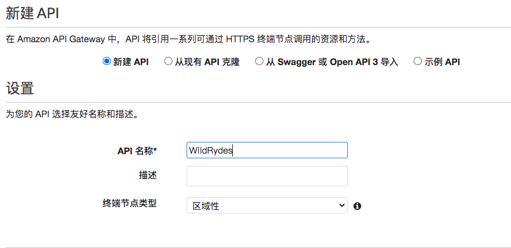
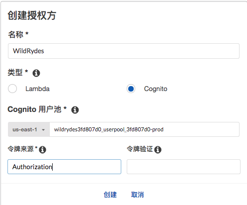
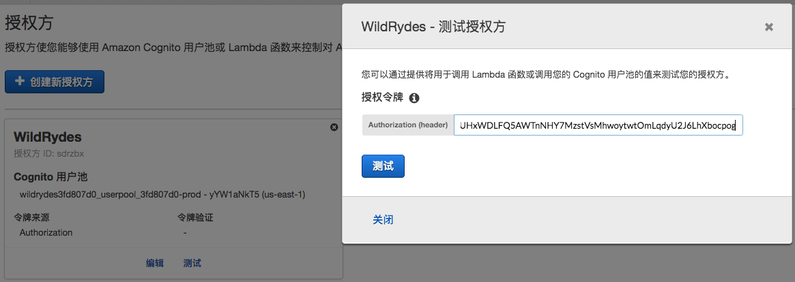
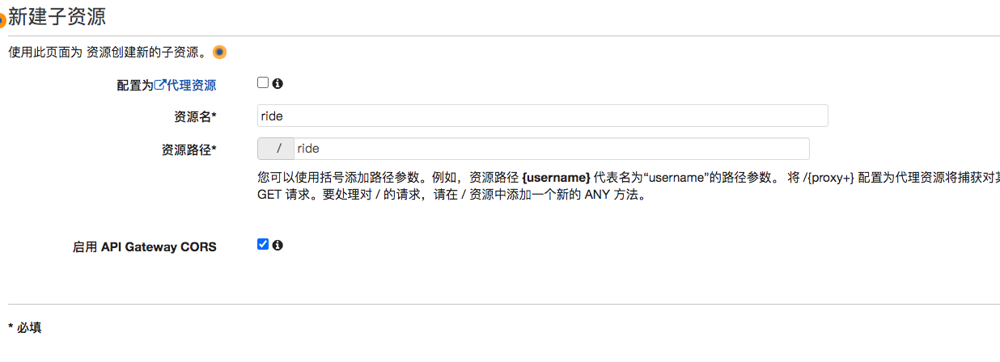
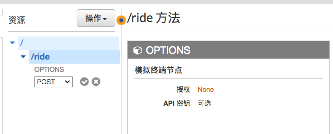
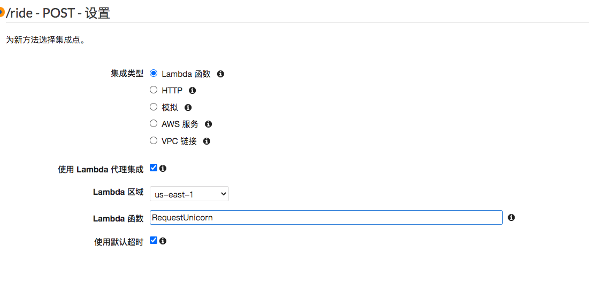
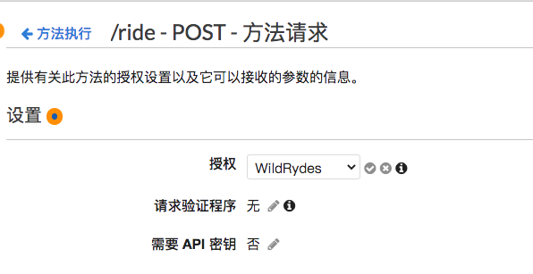

# 4. RESTFUL APIS

## 4.1 整体介绍

在此模块中，您将使用API Gateway将在上一个模块中构建的Lambda函数公开为RESTful API。该API可在公网上访问。其将使用您在用户管理模块中创建的Amazon Cognito用户池对它进行保护。然后，使用此配置，您可以通过添加客户端JavaScript香瓜代码来将静态托管的网站转变为动态Web应用程序，该JavaScript可以对公开的API进行AJAX调用。


上图显示了API Gateway如何与您先前构建的组件集成。

您在第一个模块中部署的静态网站已经有一个页面配置为与您将在此模块中构建的API交互。骑行路线具有一个简单的基于地图的界面，用于请求独角兽骑行。使用/signin进行身份验证后，您的用户可以通过单击地图上的一个点来选择他们的接送地点，并通过选择右上角的**请求独角兽**按钮来请求乘车。

本模块重点介绍构建API相关云服务所需的步骤，当然，如果您对调用此API的浏览器代码的工作方式感兴趣，则可以检查ride.js源代码。其中，应用程序使用jQuery的ajax(）方法发出远程请求。


## 4.2 创建REST API

使用Amazon API Gateway控制台创建一个名为WildRydes的新API。

**✅ 步骤 **

1. 打开[控制台](https://console.aws.amazon.com/apigateway/home)

2. 点击右上角的创建API

3. 在REST API上，选择**构建**。

4. 在**创建新API**部分中，选择**新建API**以清除示例API定义。

5. 以**WildRydes**为API名字

6. 端点类型选择**Regional**

   > ```
   > 边缘优化(Edge optimized)的API最适合从Internet访问的公共服务。区域（Regionnal）类型通常用于主要从同一AWS区域内访问的API。私有（Private API）用于Amazon VPC内部的内部服务
   > ```

7. 选择创建API

   

## 4.3 设置Cognito 用户池为其授权

### 背景

Amazon API Gateway可以使用Cognito用户池返回的JWT令牌对API调用进行身份验证。在此步骤中，您将为API配置授权者以使用您在**用户管理**中创建的用户池

### 整体介绍

在Amazon API Gateway控制台中，为您的API创建一个新的Cognito用户池授权者。使用在上一个模块中创建的用户池的详细信息配置它。通过使用当前网站的/signin 路径登录后，你可以复制并粘贴呈现的auth令牌，然后在控制台中测试配置。

**✅ 步骤 **

1. 在新创建的API下，选择**授权方**。

2. 选择创建新授权方。

3. 输入**WildRydes**作为授权方名称。

4. 选择Cognito为类型

5. 在**Cognito用户池**下**区域**下拉列表中，在**用户管理**模块中选择创建Cognito用户池的区域（默认情况下，应选择当前区域）。

6. 在**Cognito用户池**输入中输入**WildRydes**（或您为用户池指定的名称）。

7. 在令牌来源输入：Authorization。

8. 选择创建

   

   ### 验证您的授权者配置

   **✅ 步骤**

   1. 打开一个新的浏览器标签，然后在您网站的域下访问/ride。

   2. 如果您被重定向到登录页面，请使用在上一个模块中创建的用户登录。登录完后，您将被重定向回/ride。

   3. 从/ride上的通知中复制身份验证令牌

   4. 返回到您刚刚完成创建授权者的上一个页面

   5. 单击授权页面的**测试**。

   6. 将身份验证令牌粘贴到弹出对话框的**授权令牌**字段中

      

   7. 单击**测试**按钮，并验证响应代码是否200，并且您看到显示的用户声明。

      

## 4.4 创建API资源

在您的API中创建一个名为/ride的新资源。然后为该资源创建一个POST方法，并将其配置为使用Lambda代理集成，该集成由您在本模块的第一步中创建的RequestUnicorn函数支持

**✅ 步骤**

1. 在左侧导航栏中，单击WildRydes API下的**资源**。

2. 从**操作**下拉列表中，选择**创建资源**。
3. 资源名填写**ride.**
4. 确保将资源路径设置为**ride**.

5. 为资源选择**启用API网关CORS**。

6. 选择创建资源

   

7. 选择新创建的/ride资源后，从**操作**下拉列表中选择**创建方法**。

8. 从出现的新下拉列表中选择POST，然后单击复选标记。

   

9. 选择Lambda Function作为集成类型。

10. 选中**使用Lambda代理集成**框。

11. 选择Lambda函数所在的区域。

12. 输入您在上一个模块RequestUnicorn中为Lambda Function创建的函数的名称。

13. 选择保存。**请注意**，如果出现错误，说明您的功能不存在，请检查所选区域是否与上一个模块中使用的区域匹配。

    

14. 当提示您授予Amazon API Gateway调用功能的权限时，请选择确定

15. 选择**方法请求选择框**。

16. 选择**授权**旁边的铅笔图标。

17. 从下拉列表中选择WildRydes Cognito用户池授权者，然后单击复选标记图标。

     

## 4.5 部署

在Amazon API Gateway控制台中，选择**操作**，**部署API**。系统将提示您创建一个新阶段。您可以将prod用作阶段名称。

**✅  步骤**

1. 在**操作**下拉列表中，选择**部署API**
2. 在**部署阶段**下拉列表中选择**[新阶段]**。
3. 阶段名为**prod**
4. 选择**部署**
5. 记录调用URL。您将在下一部分中使用它。


##  4.6更新网站配置

更新网站部署中的`/src/config.js`文件，以包括刚刚创建的阶段的调用URL。您应该直接从Amazon API Gateway控制台的阶段编辑器页面的顶部复制调用URL，并将其粘贴到站点的`/src/config.js`文件的`_config.api.invokeUrl`密钥中。确保在更新配置文件时，它仍然包含您在上一个模块中为Cognito用户池所做的更新

**✅ 步骤**

1. 在您的Cloud9开发环境中，打开`src/config.js`.

2. 更新`config.js`文件中api密钥下的invokeUrl设置。将值设置为您在上一节中创建的部署阶段的**调用URL**。

   下面包括一个完整的config.js文件的示例。

   ```
   module.exports = {
       api: {
           invokeUrl: 'https://rfk14x9w40.execute-api.us-east-1.amazonaws.com/prod'
       }
   }
   ```

   > **⚠️ ** 对应的URL填写自身的调用URL

3. 保存修改后的文件，确保文件名仍为config.js。

4. 将更改提交到git存储库：

   ```
   git add src/config.js 
       
   git commit -m "Configure API invokeURL"
       
   git push
   ```

   [Amplify Console](https://console.aws.amazon.com/amplify/home)应该能探知到所做的更改，然后自动开始构建和部署Web应用程序。观看它以验证部署是否完成。


###  验证

**✅ 步骤**

1. 在您的网站域下访问/ride
2. 如果您被重定向到登录页面，请使用在上一个模块中创建的用户登录。
3. 地图加载后，在地图上的任意位置单击以设置上车位置。
4. 选择右上角Request Unicorn。您应该在右侧栏中看到一条通知，告知Unicorn正在赶来中，并最终到上车点


##  4.7 回顾

 🔑Amazon API Gateway是一项完全托管的服务，使开发人员可以轻松地创建，发布，维护，监控和保护各种规模的API。您可以轻松地通过Amazon Cognito和后端（例如AWS Lambda）插入授权来创建完全无服务器的API。

🔧在本模块中，您已使用API网关向在上一个模块中创建的Lambda函数提供REST API。从那里开始，您已经更新了网站以使用API端点，以便可以请求游乐设施，并且有关游乐设施的信息将保存在之前创建的DynamoDB表中。


