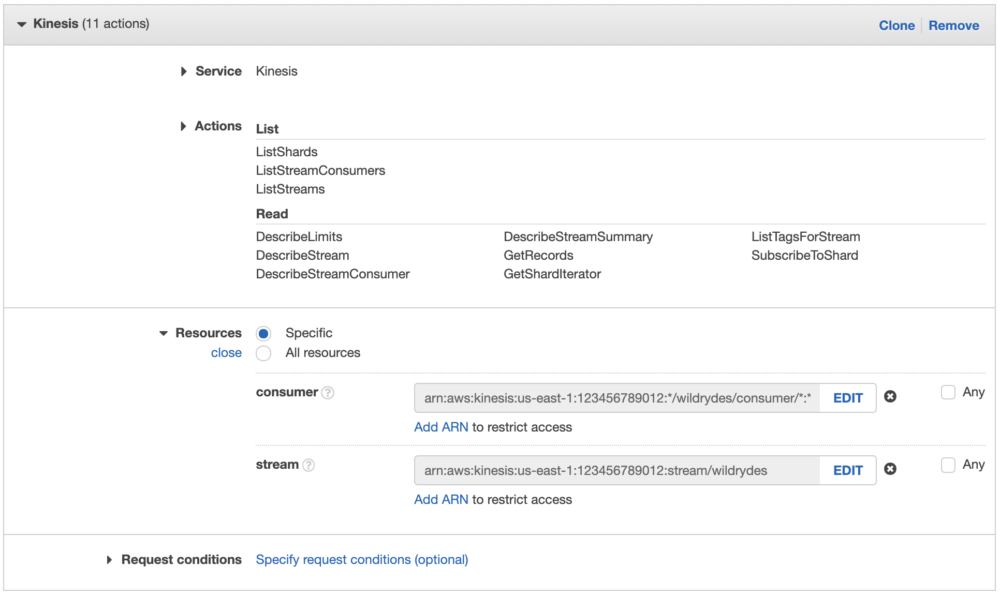
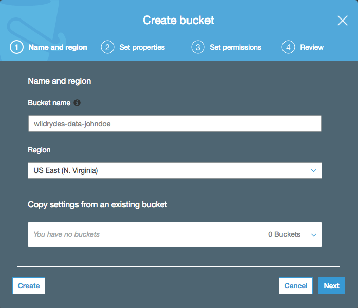
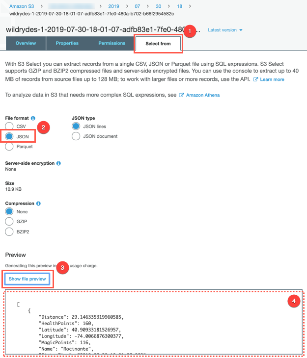

# 车辆实时数据采集、分析与存储

这是一个200级别的动手实验，旨在说明如何使用AWS服务在无服务器的架构下来处理实时数据流。在本实验中，我们将建立基础设施，以使Wild Rydes总部的运营人员能够监控其独角兽车队的健康状况。 每个独角兽都配备了传感器，可报告其位置和生命体征。 在本实验中，我们将使用AWS来构建应用程序以实时处理和可视化这些数据。

我们将使用各种AWS服务，包括：Amazon Kinesis，AWS Lambda，Amazon Simple Storage Service（Amazon S3），Amazon DynamoDB，Amazon Cognito和Amazon Athena。 我们将使用Lambda处理实时流，使用DynamoDB保留独角兽生命，使用Amazon Kinesis Data Analytics构建无服务器应用程序来聚合数据，使用Amazon Kinesis Data Firehose将原始数据存档到Amazon S3，并使用Athena运行ad- 临时查询原始数据。

模块

实验分为四个模块。 每个模块都描述了我们将要构建的场景以及分步指导，以帮助您实现架构并验证工作。

## 实时流数据
在Kinesis中创建一个流，并对其进行读写操作，以在实时地图上跟踪Wild Rydes独角兽。 在此模块中，您还将创建一个Amazon Cognito身份池，以授予实时地图访问您的流的权限。

## 流式聚合
构建一个Kinesis Data Analytics应用程序以从流中读取并汇总指标，例如独角兽的健康状况和每分钟的行进距离。

## 流处理
坚持将数据从应用程序聚合到DynamoDB中存储的后端数据库，并对这些数据运行查询。

## 数据湖
使用Kinesis Data Firehose将原始传感器数据冲洗到S3存储桶中以进行存档。 使用Athena，您将对原始数据运行SQL查询以进行临时分析。

# 1. 环境配置

## AWS账号
为了完成此研讨会，您需要一个AWS帐户并具有访问权限，以在该帐户中创建AWS Identity and Access Management（IAM），Amazon Cognito，Amazon Kinesis，Amazon S3，Amazon Athena，Amazon DynamoDB和AWS Cloud9资源。

本研讨会中的代码和说明假定一次只有一名参与者正在使用给定的AWS账户。 如果您尝试与其他参与者共享帐户，则将遇到某些资源的命名冲突。 您可以通过在资源名称中使用后缀或使用不同的Region来解决此问题，但是说明中没有提供进行此项工作所需的更改的详细信息。

请使用个人帐户或为此研讨会创建一个新的AWS帐户，而不要使用组织的帐户，以确保您拥有对必要服务的完全访问权限，并确保您不浪费任何资源。

## AWS Cloud9 IDE
AWS Cloud9是基于云的集成开发环境（IDE），可让您仅使用浏览器即可编写，运行和调试代码。 它包括代码编辑器，调试器和终端。 Cloud9预先打包了用于流行编程语言的基本工具，并且预先安装了AWS Command Line Interface（CLI），因此您无需为此研讨会安装文件或配置笔记本电脑。 您的Cloud9环境将有权访问与您登录AWS管理控制台的用户相同的AWS资源。

## 现在花点时间设置Cloud9开发环境。

分步说明

1. 转到AWS管理控制台，单击服务，然后在开发人员工具下选择Cloud9。

2. 单击创建环境。

3. 在名称中输入Development并提供描述。

4. 单击下一步。

5. 您可以将环境设置保留为默认值，以启动新的t2.micro EC2实例，该实例在闲置30分钟后将暂停。

6. 单击下一步。

7. 查看环境设置，然后单击“创建环境”。 调配和准备环境需要几分钟。

8. 准备就绪后，您的IDE将打开欢迎屏幕。 在其下，您应该看到类似于以下内容的终端提示：

您可以在此处运行AWS CLI命令，就像在本地计算机上一样。 通过运行来验证您的用户已登录
'''
aws sts get-caller-identity
'''

您会看到显示指示您的帐户和用户信息的输出：
'''
Admin:~/environment $ aws sts get-caller-identity
'''

'''
{
    "Account": "123456789012",
    "UserId": "AKIAI44QH8DHBEXAMPLE",
    "Arn": "arn:aws:iam::123456789012:user/Alice"
}
'''
在整个研讨会中，请始终在选项卡中打开AWS Cloud9 IDE，因为它将用于诸如在Docker容器中构建和运行示例应用程序以及使用AWS CLI的活动。

## 命令行客户端
这些模块利用两个命令行客户端来模拟和显示车队中独角兽的传感器数据。这些是用Go编程语言编写的小程序。以下“安装”部分中的说明逐步下载了预构建的二进制文件，但是您也可以下载源代码并手动构建它：

producer.go
consumer.go

生产者
生产者从独角兽生成传感器数据，该独角兽载着乘客乘坐Wild Ryde。每秒，它将发出独角兽的位置作为纬度和经度点，前一秒以米为单位的行进距离，以及独角兽当前的魔法和健康点等级。

使用者
消费者从Amazon Kinesis流中读取并显示格式化的JSON消息，这使我们可以实时监视发送到该流的内容。使用使用者，您可以监视生产者和您的应用程序正在发送的数据。

安装
切换到您的Cloud9环境已打开的选项卡。

通过在Cloud9终端中运行以下命令来下载并解压缩命令行客户端：
'''
curl -s https://data-processing.serverlessworkshops.io/client/client.tar | tar -xv
'''
这会将Consumer和Producer文件解压缩到您的Cloud9环境中。

# 2. 实时流数据

在此模块中，您将创建一个Amazon Kinesis流，以收集和存储来自我们的独角兽舰队的传感器数据。 使用提供的命令行客户端，您将从Wild Ryde上的独角兽生成传感器数据并从流中读取。 最后，您将使用独角兽仪表板在地图上绘制独角兽，并实时查看其状态。 在随后的模块中，您将添加功能，以使用Amazon Kinesis Data Analytics，AWS Lambda和Amazon DynamoDB分析和保留这些数据。

## 概览
该模块的架构涉及Amazon Kinesis流，生产者和使用者。

我们的生产者是一个连接到独角兽的传感器，该独角兽目前正在搭乘乘客。 该传感器每秒发送一次数据，包括独角兽的当前位置，前一秒的行进距离以及魔点和生命值，以便我们的运营团队可以从Wild Rydes总部监控独角兽舰队的健康状况。

Amazon Kinesis流存储了生产者发送的数据，并提供了一个接口，以允许消费者处理和分析这些数据。 我们的使用者是一个简单的命令行实用程序，它可以跟踪流并有效地实时输出流中的数据点，因此我们可以看到流中存储了哪些数据。 一旦从流中发送和接收数据，我们就可以使用独角兽仪表板实时查看独角兽舰队的当前位置和生命力。

## 实现
请确认已经完成第一步的环境安装

## 创建Amazon Kinesis流
使用Amazon Kinesis Data Streams控制台创建一个具有1个分片的名为wildrydes的新流。

1.转到AWS管理控制台，单击服务，然后在分析下选择Kinesis。

2.如果出现介绍性屏幕提示，请单击“入门”。

3.单击创建数据流。

4.在Kinesis流名称中输入wildrydes，在分片数量中输入1，然后单击Create Kinesis stream。

5.在60秒内，您的Kinesis流将处于活动状态，并准备存储实时流数据。

## 发送消息到流
使用命令行生产者将消息产生到流中。

1.切换到打开Cloud9环境的选项卡。

2.在终端中，运行生产者以开始向流中发送传感器数据。
'''
./producer
'''
生产者每秒向流发送一条消息，并在屏幕上显示一个句点。
'''
$ ./producer -region us-east-1
..................................................
'''

3.在Amazon Kinesis Streams控制台中，单击wildrydes，然后单击监视选项卡。

4.几分钟后，您将看到“推杆记录成功率”（百分比）-“平均”图开始记录一次推杆。

## 从流中读取消息

切换到打开Cloud9环境的选项卡。

点击（+）按钮，然后单击“新建终端”以打开新的终端选项卡。

运行使用者以开始从流中读取传感器数据。
'''
./consumer
'''
消费者将打印生产者发送的消息：
'''
{
  "Name": "Shadowfax",
  "StatusTime": "2017-06-05 09:17:08.189",
  "Latitude": 42.264444250051326,
  "Longitude": -71.97582884770408,
  "Distance": 175,
  "MagicPoints": 110,
  "HealthPoints": 150
}
{
  "Name": "Shadowfax",
  "StatusTime": "2017-06-05 09:17:09.191",
  "Latitude": 42.265486935100476,
  "Longitude": -71.97442977859625,
  "Distance": 163,
  "MagicPoints": 110,
  "HealthPoints": 151
}
'''

## 为独角兽仪表板创建身份池
创建一个Amazon Cognito身份池，以授予未经身份验证的用户访问您的Kinesis流的权限。 记下要在下一步中使用的身份池ID。

1.转到AWS管理控制台，单击服务，然后在安全性，身份和合规性下选择Cognito。

2.单击管理身份池。

3.单击创建新的身份池。

4.在身份池名称中输入wildrydes。

5.选中启用对未经身份验证的身份的访问复选框。

6.单击创建池。

7.单击允许，这将为您的身份池创建经过身份验证和未经身份验证的角色。

8.单击转到仪表板。

9.点击右上角的编辑身份池。

10.请注意身份池ID，以在以后的步骤中使用。

## 授予未经身份验证的角色访问流
向未经身份验证的角色添加新策略，以允许仪表板从流中读取数据，以在地图上绘制独角兽。

1.转到AWS管理控制台，单击服务，然后在安全性，身份和合规性下选择IAM。

2.单击左侧导航中的角色。

3.单击Cognito_wildrydesUnauth_Role。

4.单击添加内联策略。

5.单击选择服务，然后单击Kinesis。

6.单击操作。

7.勾选读取和列出权限复选框。

8.单击资源将角色限制为wildrydes流和使用者。

9.单击使用者旁边的添加ARN。

10.在“添加ARN”对话框中，输入以下信息：
   您在地区中使用的地区（例如us-east-1）
   您在帐户中的帐户ID
   *在流类型中
   流名称中的wildrydes
   *以消费者名称
   *在消费者创建时间戳记中

11.单击添加。

12.单击流旁边的添加ARN。

13.在“添加ARN”对话框中，输入以下信息：
   您在地区中使用的地区（例如us-east-1）
   您在帐户中的帐户ID
   流名称中的wildrydes

14.点击添加

15.点击查看策略。

16.在名称中输入WildrydesDashboardPolicy。

17.单击创建策略。

## 在仪表板上查看独角兽状态
使用独角兽仪表板在实时地图上查看独角兽。

1.打开独角兽仪表板。

2.输入您在步骤4中记下的Cognito身份池ID，然后单击“开始”。

3.验证您可以在地图上看到独角兽。

4.单击独角兽以查看流中的更多详细信息。

## 使用生产者
在观察仪表板和使用者的同时停止并启动生产者。 用不同的独角兽名称开始多个生产者。

1.通过按Control + C停止生产者，并注意消息停止并且30秒后独角兽消失。

2.再次启动生产者，并注意消息恢复并且独角兽再次出现。

3.点击（+）按钮，然后单击“新建终端”以打开新的终端选项卡。

4.在新选项卡中启动生产者的另一个实例。 在消费者的输出中提供一个特定的独角兽名称并注意两个独角兽的数据点：
'''
./producer -name Bucephalus
'''

检查仪表板并确认您看到多个独角兽。

# 流聚合

在此模块中，您将创建一个Amazon Kinesis Data Analytics应用程序，以实时聚合来自独角兽车队的传感器数据。 该应用程序将从Amazon Kinesis流中读取数据，计算当前在Wild Ryde上每个独角兽的行进总距离以及最小和最大健康与魔点，并将这些汇总的统计信息每分钟输出到Amazon Kinesis流。

## 总览
该模块的架构涉及Amazon Kinesis Data Analytics应用程序，源和目标Amazon Kinesis流以及生产者和消费者命令行客户端。

Amazon Kinesis Data Analytics应用程序处理我们在上一个模块中创建的源Amazon Kinesis流中的数据，并按分钟汇总。 每分钟，该应用程序都会发出数据，包括最后一分钟的总行驶距离，以及我们机队中每个独角兽的健康点和魔点的最小和最大读数。 这些数据点将被发送到目标Amazon Kinesis流，以供系统中的其他组件处理。

## 实现

## 创建Amazon Kinesis流
使用Amazon Kinesis Data Streams控制台创建一个新的名为wildrydes-summary的带1个分片的流。

1.转到AWS管理控制台，单击服务，然后在分析下选择Kinesis。

2.如果出现介绍性屏幕提示，请单击“入门”。

3.单击创建数据流。

4.在Kinesis流名称中输入wildrydes-summary，在分片数量中输入1，然后单击Create Kinesis stream。

5.在60秒内，您的Kinesis流将处于活动状态，并准备存储实时流数据。

## 创建Amazon Kinesis Data Analytics应用程序

构建一个Amazon Kinesis Data Analytics应用程序，该应用程序从上一个模块中内置的wildrydes流中读取数据，并每分钟发出一个具有以下属性的JSON对象：

Name|Unicorn name
--|:--
StatusTime|ROWTIME provided by Amazon Kinesis Data Analytics
Distance|The sum of distance traveled by the unicorn
MinMagicPoints|The minimum data point of the MagicPoints attribute
MaxMagicPoints|The maximum data point of the MagicPoints attribute
MinHealthPoints|The minimum data point of the HealthPoints attribute
MaxHealthPoints|The maximum data point of the HealthPoints attribute

将应用程序的目标流设置为wildrydes-summary。
1.切换到打开Cloud9环境的选项卡。

2.运行生产者以开始向流发送传感器数据。
'''
./producer
'''

3.在构建应用程序时主动生成传感器数据将使Amazon Kinesis Data Analytics自动检测我们的架构。

   转到AWS管理控制台，单击服务，然后在分析下选择Kinesis。

   单击创建分析应用程序。

   在应用程序名称中输入wildrydes，然后单击创建应用程序。

   单击连接流数据。

   从Kinesis流中选择wildrydes。

4.向下滚动并单击发现架构，请稍等片刻，并确保已正确自动发现该架构。

5.确保自动发现的架构包括：
    Column|	Data Type
    --|:--
    Distance|	DOUBLE
    HealthPoints|	INTEGER
    Latitude|	DOUBLE
    Longitude|	DOUBLE
    MagicPoints|	INTEGER
    Name|	VARCHAR(16)
    StatusTime|	TIMESTAMP   

6.单击保存并继续。

7.单击转到SQL编辑器。 这将打开一个交互式查询会话，在此我们可以在实时Amazon Kinesis流的基础上构建查询。

8.单击是，启动应用程序。 您的应用程序启动将需要30-90秒。

9.将以下SQL查询复制并粘贴到SQL编辑器中：
'''
CREATE OR REPLACE STREAM "DESTINATION_SQL_STREAM" (
  "Name"                VARCHAR(16),
  "StatusTime"          TIMESTAMP,
  "Distance"            SMALLINT,
  "MinMagicPoints"      SMALLINT,
  "MaxMagicPoints"      SMALLINT,
  "MinHealthPoints"     SMALLINT,
  "MaxHealthPoints"     SMALLINT
);

CREATE OR REPLACE PUMP "STREAM_PUMP" AS
  INSERT INTO "DESTINATION_SQL_STREAM"
    SELECT STREAM "Name", "ROWTIME", SUM("Distance"), MIN("MagicPoints"),
                  MAX("MagicPoints"), MIN("HealthPoints"), MAX("HealthPoints")
    FROM "SOURCE_SQL_STREAM_001"
    GROUP BY FLOOR("SOURCE_SQL_STREAM_001"."ROWTIME" TO MINUTE), "Name";
'''
10.单击“保存并运行SQL”。 每分钟，您将看到包含聚合数据的行到达。 等待行到达。

11.单击关闭链接。

12.单击连接到目标。

13.从Kinesis流中选择wildrydes-summary。

14.从应用程序内流名称中选择DESTINATION_SQL_STREAM。

15.单击保存并继续。

## 阅读信息流中的消息

1.切换到打开Cloud9环境的选项卡。

2.运行使用者以开始从流中读取传感器数据。
'''
./consumer -stream wildrydes-summary
'''

3.使用者将每分钟打印一次Kinesis Data Analytics应用程序发送的消息：
'''
{
  "Name": "Shadowfax",
  "StatusTime": "2018-03-18 03:20:00.000",
  "Distance": 362,
  "MinMagicPoints": 170,
  "MaxMagicPoints": 172,
  "MinHealthPoints": 146,
  "MaxHealthPoints": 149
}
'''
## producer实验

1.在观察仪表板和使用者的同时停止并启动生产者。 用不同的独角兽名称开始多个生产者。

2.切换到打开Cloud9环境的选项卡。

3.通过按Control + C停止生产者，并注意消息已停止。

4.重新启动生产者，并注意消息恢复。

5.点击（+）按钮，然后单击“新建终端”以打开新的终端选项卡。

6.在新选项卡中启动生产者的另一个实例。 在消费者的输出中提供一个特定的独角兽名称并注意两个独角兽的数据点：
'''
./producer -name Bucephalus
'''

7.验证您在输出中看到多个独角兽：
'''
{
    "Name": "Shadowfax",
    "StatusTime": "2018-03-18 03:20:00.000",
    "Distance": 362,
    "MinMagicPoints": 170,
    "MaxMagicPoints": 172,
    "MinHealthPoints": 146,
    "MaxHealthPoints": 149
}
{
    "Name": "Bucephalus",
    "StatusTime": "2018-03-18 03:20:00.000",
    "Distance": 1773,
    "MinMagicPoints": 140,
    "MaxMagicPoints": 148,
    "MinHealthPoints": 132,
    "MaxHealthPoints": 138
}
'''

# 流处理

在此模块中，您将使用AWS Lambda处理来自先前创建的wildrydes Amazon Kinesis流的数据。 我们将创建并配置Lambda函数，以从流中读取数据并将记录到达时将记录写入Amazon DynamoDB表。

## 实现

## 创建Amazon Dynomodb
使用Amazon DynamoDB控制台创建新的DynamoDB表。 调用表UnicornSensorData并为其分配一个名为Name的类型为String的分区键和一个名为StatusTime的为String类型的排序键。 将默认设置用于所有其他设置。

创建表格后，请记下下一节要使用的Amazon资源名称（ARN）。

1.转到AWS管理控制台，选择服务，然后在数据库下选择DynamoDB。

2.单击创建表。

3.输入UnicornSensorData作为表名。

4.为分区键输入名称，然后为键类型选择字符串。

5.勾选添加排序键复选框。 输入“状态时间”作为“排序”键，然后选择“字符串”作为键类型。

6.保留使用默认设置复选框，然后选择创建。

7.滚动到新表属性的“表详细信息”部分，并记下亚马逊资源名称（ARN）。 您将在下一步中使用它。

## 为Lambda函数创建IAM Role
使用IAM控制台创建新角色。 将其命名为WildRydesStreamProcessorRole并选择Lambda作为角色类型。 将名为AWSLambdaKinesisExecutionRole的托管策略附加到此角色，以便为您的功能授予权限以从Amazon Kinesis流读取并登录到Amazon CloudWatch Logs。 创建一个策略，该策略允许dynamodb：BatchWriteItem访问上一节中创建的DynamoDB表，并将其附加到新角色。

1.在AWS控制台中，单击服务，然后在“安全性，身份和合规性”部分中选择IAM。

2.从左侧导航中选择“策略”，然后单击“创建策略”。

3.我们将使用Visual编辑器创建一个IAM策略，以允许Lambda函数访问在上一节中创建的DynamoDB表。首先，单击“服务”，开始在“查找服务”中键入DynamoDB，然后单击“ DynamoDB”。

4.单击“操作”，开始在“筛选器操作”中键入BatchWriteItem，然后选中“ BatchWriteItem”复选框。

5.单击“资源”，单击“在表中添加ARN”，然后通过指定“区域”，“帐户”和“表名”来构造在上一部分中创建的DynamoDB表的ARN。

6.在区域中，在上一节中输入您在其中创建DynamoDB表的AWS区域，例如：us-east-1。

7.在“账户”中，输入十二位数的AWS账户ID，例如：123456789012。要在AWS管理控制台中找到您的AWS账户ID号，请单击右上角导航栏中的“支持”，然后单击“支持中心”。 。您当前登录的帐户ID出现在“支持”菜单下方的右上角。

8.在表名称中，输入UnicornSensorData。

9.您应该在“为表指定ARN”字段中看到您的ARN，并且其外观应类似于：

10.点击添加

11.点击审查策略

12.在名称字段中输入WildRydesDynamoDBWritePolicy。

13.单击创建策略。

14.从左侧导航中选择“角色”，然后单击“创建角色”。

15.在AWS服务部分，单击Lambda作为角色类型。

16.单击“下一步：权限”。

17.开始在“过滤器”文本框中键入AWSLambdaKinesisExecutionRole，然后选中该角色旁边的框。

18.开始在“过滤器”文本框中键入WildRydesDynamoDBWritePolicy，然后选中该角色旁边的框。

19.单击下一步：审阅。

20.输入WildRydesStreamProcessorRole作为角色名称。

21.单击创建角色。

## 创建Lambda函数处理数据流

创建一个称为WildRydesStreamProcessor的Lambda函数，只要在wildrydes流中有新记录可用时，就会触发该函数。 将提供的index.js实现用于您的功能代码。 使用键TABLE_NAME和值UnicornSensorData创建一个环境变量。 将函数配置为使用上一部分中创建的WildRydesStreamProcessor角色。

1.转到AWS管理控制台，选择服务，然后在计算下选择Lambda。

2.单击创建函数。

3.在功能名称字段中输入WildRydesStreamProcessor。

4.从运行时中选择Node.js10.x。

5.从“现有角色”下拉列表中选择WildRydesStreamProcessorRole。

6.单击创建功能。

7.向下滚动到“功能代码”部分。

8.将下面的JavaScript代码复制并粘贴到代码编辑器中。

'''
'use strict';

const AWS = require('aws-sdk');
const dynamoDB = new AWS.DynamoDB.DocumentClient();
const tableName = process.env.TABLE_NAME;

exports.handler = function(event, context, callback) {
  const requestItems = buildRequestItems(event.Records);
  const requests = buildRequests(requestItems);

  Promise.all(requests)
    .then(() => callback(null, `Delivered ${event.Records.length} records`))
    .catch(callback);
};

function buildRequestItems(records) {
  return records.map((record) => {
    const json = Buffer.from(record.kinesis.data, 'base64').toString('ascii');
    const item = JSON.parse(json);

    return {
      PutRequest: {
        Item: item,
      },
    };
  });
}

function buildRequests(requestItems) {
  const requests = [];

  while (requestItems.length > 0) {
    const request = batchWrite(requestItems.splice(0, 25));

    requests.push(request);
  }

  return requests;
}

function batchWrite(requestItems, attempt = 0) {
  const params = {
    RequestItems: {
      [tableName]: requestItems,
    },
  };

  let delay = 0;

  if (attempt > 0) {
    delay = 50 * Math.pow(2, attempt);
  }

  return new Promise(function(resolve, reject) {
    setTimeout(function() {
      dynamoDB.batchWrite(params).promise()
        .then(function(data) {
          if (data.UnprocessedItems.hasOwnProperty(tableName)) {
            return batchWrite(data.UnprocessedItems[tableName], attempt + 1);
          }
        })
        .then(resolve)
        .catch(reject);
    }, delay);
  });
}
'''

9.在“环境变量”部分中，使用键TABLE_NAME和值UnicornSensorData输入环境变量。

10.在基本设置部分。 将超时设置为1分钟。

11.向上滚动并从“设计器”部分中选择Kinesis。

12.在“配置触发器”部分中，从Kinesis Stream中选择wildrydes-summary。

13.将“批次大小”设置为100，并将“开始位置”设置为“最新”。

14.单击添加。

15.单击“启用”以启用触发器。

16.点击保存

## 监控Lambda
验证触发器是否正确执行Lambda函数。 查看该函数发出的度量并检查Lambda函数的输出。

1.运行生产者，以唯一的独角兽名称开始向流发送传感器数据。
'''
./producer -name Rocinante
'''

2.单击“监视”选项卡，然后浏览可用于监视功能的指标。 单击跳转到日志以浏览该功能的日志输出。

## 查询DynamoDB
使用AWS管理控制台，在DynamoDB表中查询特定独角兽的数据。 使用生产者从唯一的独角兽名称创建数据，并验证这些记录是否持久。

1.单击服务，然后在数据库部分中选择DynamoDB。

2.点击左侧导航栏中的表格

3.单击UnicornSensorData。

4.单击项目选项卡。 在这里，您应该看到要运行生产者的每个Unicorn的每分钟数据点。

# 数据湖
在本模块中，您将创建一个Amazon Kinesis Data Firehose，以将数据从第一个模块中创建的Amazon Kinesis流分批传输到Amazon Simple Storage Service（Amazon S3）。 然后，您将使用Amazon Athena对我们的原始数据运行查询。

## 概览
该模块的架构基于您在第一个模块中创建的Amazon Kinesis流。 您将使用Amazon Kinesis Data Firehose批处理数据并将其传送到Amazon S3进行归档。 使用Amazon Athena，您将对Amazon S3存储桶中的原始数据运行临时查询。

## 实现

## 创建S3存储桶
使用控制台或CLI创建S3存储桶。 请记住，您的存储桶名称必须是全局唯一的。 我们建议使用诸如wildrydes-data-yourname之类的名称。

1.在AWS控制台中，单击服务，然后在存储下选择S3。

2.点击+创建存储桶

3.为您的存储桶提供一个全球唯一的名称，例如wildrydes-data-yourname。

4.选择您的存储桶使用的区域。

5.单击“下一步”三次，然后单击“创建存储桶”。

## 创建Amazon Kinesis Data Firehose交付流

创建一个名为wildrydes的Amazon Kinesis Data Firehose交付流，该流被配置为从wildrydes流中获取数据，并将其内容分批交付给上一部分中创建的S3存储桶。

1.在AWS控制台中，单击服务，然后在分析下选择Kinesis。

2.点击创建投放流。

3.在投放流名称中输入wildrydes。

4.选择Kinesis流作为Source，然后选择wildrydes作为源流。

5.点击下一步。

6.禁用“记录转换”和“记录格式”对话，然后单击“下一步”。

7.从目标中选择Amazon S3。

8.从S3存储桶中选择您在上一部分中创建的存储桶（即wildrydes-data-johndoe）。

9.点击下一步。

10.在“ S3缓冲区”下的“缓冲区间隔”中输入60，以将S3交付的频率设置为每分钟一次。

11.向下滚动到页面底部，然后单击“新建”或“从IAM角色中选择”。 在新选项卡中，单击允许。

12.点击下一步。 查看传送流详细信息，然后单击创建传送流。

## 创建Amazon Athena 表

创建一个Amazon Athena表以使用JSON SerDe在Amazon S3上查询原始数据。 将表命名为wildrydes，并将属性包括在原始数据中：
.Name (string)
.StatusTime (timestamp)
.Latitude (float)
.Longitude (float)
.Distance (float)
.MagicPoints (int)
.HealthPoints (int)

1.单击“服务”，然后在“分析”部分中选择“雅典娜”。

2.如果出现提示，请单击“入门”，然后通过单击模式对话框右上角的x退出首次运行的教程。

3.复制并粘贴以下SQL语句以创建表。 在LOCATION子句中，将YOUR_BUCKET_NAME_HERE占位符替换为您的存储桶名称（例如wildrydes-data-johndoe）：

'''
CREATE EXTERNAL TABLE IF NOT EXISTS wildrydes (
       Name string,
       StatusTime timestamp,
       Latitude float,
       Longitude float,
       Distance float,
       HealthPoints int,
       MagicPoints int
     )
     ROW FORMAT SERDE 'org.apache.hive.hcatalog.data.JsonSerDe'
     LOCATION 's3://YOUR_BUCKET_NAME_HERE/';
'''

4.单击运行查询。

5.通过确保已将表Wildrydes添加到左侧导航栏中的表列表中，来验证该表是否已创建。

## 浏览批处理的数据文件

使用AWS管理控制台，导航到用作Kinesis Data Firehose交付目标的S3存储桶。 验证Firehose是否将批处理的数据文件传递到存储桶。 下载其中一个文件，然后在文本编辑器中将其打开以查看内容。

1.单击服务，然后在存储部分中选择S3。

2.输入您在“搜索存储桶”文本输入的第一部分中创建的存储桶名称。

3.单击存储桶名称，然后浏览年，月，日和小时文件夹，以确保文件已填充到存储桶中。

4.单击其中一个文件。

5.单击选择来源选项卡，从文件格式中选择JSON，然后单击显示文件预览以预览文件内容。

## 查询数据文件

查询Amazon Athena表以查看已通过Kinesis Data Firehose传递到S3的所有记录。

1.单击“服务”，然后在“分析”部分中选择“雅典娜”。

2.复制并粘贴以下SQL查询：
'''
SELECT * FROM wildrydes
'''

3.单击运行查询。

# 进阶讨论

如果您有空闲时间继续修补独角兽监控系统，请尝试以下其他方法：

.使用AWS开发工具包以您选择的编程语言编写wildrydes流的使用者。 试用输出格式。

.构建一个Amazon Kinesis Data Analytics应用程序，该应用程序从wildrydes流中读取并选择任何独角兽生命体征低于100点的数据点。

.创建一个AWS Lambda函数以从流中读取并在任何独角兽的生命体征低于100点时向操作人员发送主动警报。

.编写其他Amazon Athena查询。 找：

    .选择旅途中独角兽报告的所有纬度和经度对。
    .在特定时间戳记之后捕获的所有数据点。
    .每个独角兽旅行的总时间。
    .独角兽的生命值低于100点的所有数据点。

# 清理环境

以下是在本研讨会中创建的资源列表。执行模块后，请删除每个帐户以清理您的帐户。

## Athena
wildrydes表

.单击服务，然后在“分析”部分中选择“Athena”。

.单击wildrydes 表旁边的溢出（三个垂直点）图标，然后单击Delete table。

.单击“是”确认删除。

## Amazon Kinesis Data Firehose
wildrydes delivery流

.单击服务，然后在“分析”部分中选择Kinesis。

.点击查看所有在室壁运动输送流..

.单击wildrydes以选择单选按钮。

.单击操作和删除。

.输入流的名称（wildrydes），然后单击Delete确认删除。

## Amazon S3
数据桶（例如wildrydes-data-yourname）

.单击服务，然后在存储部分中选择S3。

.单击存储桶的行（例如wildydes-data-yourname）以突出显示它。

.点击删除存储桶。

.输入存储桶的名称（例如wildrydes-data-yourname），然后单击“ 确认”以确认删除。

## AWS Lambda
WildRydesStreamProcessor函数

.单击服务，然后在计算部分中选择Lambda。

.单击WildRydesStreamProcessor旁边的单选按钮。

.单击操作和删除。单击删除按钮以确认删除。

# Amazon DynamoDB
UnicornSensorData表

.单击服务，然后在数据库部分中选择DynamoDB。

.在左侧导航栏中单击表格。

.单击UnicornSensorData旁边的单选按钮。

.单击删除表，然后单击删除以确认删除。

## AWS IAM
WildRydesDynamoDBWritePolicy策略

.单击服务，然后在“安全性，身份和合规性”部分中选择IAM。

.单击左侧导航中的策略。

.从过滤器中选择客户管理。

.单击WildRydesDynamoDBWritePolicy旁边的复选框。

.单击策略操作，然后单击删除。单击删除按钮以确认删除。

.WildRydesStreamProcessor角色

.点击左侧导航栏中的角色。

.单击WildRydesStreamProcessor旁边的复选框。

.单击“删除角色”，然后单击“是，删除”以确认删除。

## Amazon Kinesis数据分析
wildrydes应用

.单击服务，然后在“分析”部分中选择Kinesis。

.点击查看所有在室壁运动分析应用。

.单击wildrydes以选择单选按钮。

.单击“操作并删除应用程序”。单击删除应用程序以确认删除。

## Amazon Kinesis数据流
wildrydes and wildrydes-summary 流

.单击服务，然后在“分析”部分中选择Kinesis。

.点击查看所有在室壁运动数据流。

.单击wildrydes和wildrydes-summary旁边的复选框。

.单击操作和 删除。单击删除以确认删除。